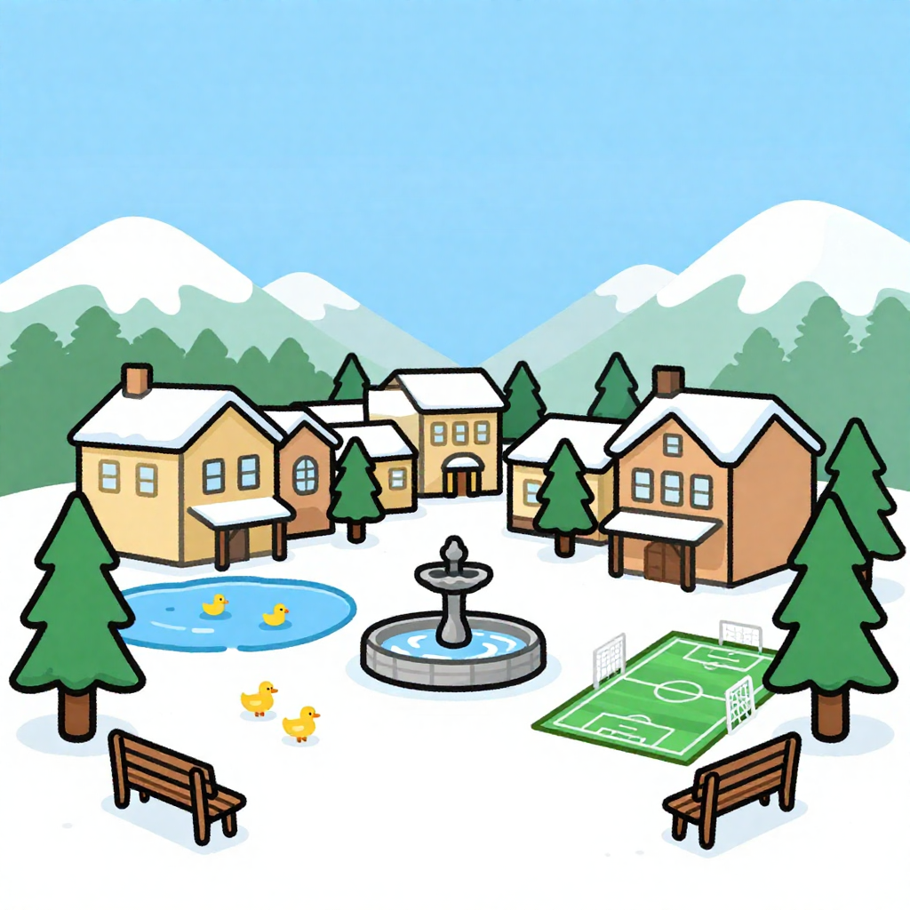

# Nilton Park 🎿

Sala de comunicação multiplayer no navegador, estilo Habbo, com cara de desenho
tosco de papel recortado. Entre com um nick, ande pela praça, converse com balões
flutuantes, dance, solte um pum, jogue pedra no lago e chute a bola.



## Rodando
Requer Node 20+.
```bash
npm install
npm start
```
Abra http://localhost:3000 em duas abas (ou dois computadores na mesma rede usando o IP da máquina) para ver o multiplayer.
Quer movimento na sala sem chamar amigos? `node scripts/bots.js 5`.

## Controles
| Ação | Como |
|---|---|
| Andar | Clique no chão · ou WASD / setas |
| Interagir | Clique em: **fonte** (moeda), **banco** (sentar), **poste** (liga/desliga), **lago** (pedra), **pato** (quack), **bola** (chutar) |
| Chat | `Enter` para focar, digite, `Enter` para enviar · `Esc` sai |
| Emotes | `1` acenar · `2` pular · `3` dançar · `4` pum · `5` sentar (ou `/dance`, `/wave`, `/jump`, `/fart`, `/sit`) |

## 📱 Celular
Abra no navegador do celular (mesma rede Wi-Fi): `http://IP-DO-PC:3000` — a interface mobile liga sozinha
(toque detectado). Para forçar: `?mobile=1` (ou `?mobile=0` para o layout de PC).
- **Joystick** (canto esquerdo) ou toque no chão para andar · **⬆ PULAR** e **😜** emotes (canto direito)
- Topo: **☰** menu (som, ajuda, trocar visual) · **💬** chat (com contador de não lidas) · **👥** quem está online
- Toque num boneco para desafiar · no Gol a Gol: toque no campo para mirar, **segure ⚽ CHUTAR** e solte na ⭐,
  **↺ ↻** dão efeito; defendendo, joystick move e **🧤⬆ / 🧤⬇** mergulham. Deitado o campo fica maior.

## ⚽ Minigame: Gol a Gol
Clique em outro player → **Desafiar: Gol a Gol**. Cada um defende um gol e vocês alternam os chutes. **Primeiro gol vence!**
- **Chutando**: mire com o mouse, **segure e solte** para a força (acerte a ⭐; passou do vermelho = isola), **Q/E** ou roda do mouse para dar efeito, **W/S** para mover a bola.
- **Defendendo**: mova o mouse (ou W/S) na linha do gol, **clique/Espaço** para mergulhar.
- Perdeu? Aparece o botão **Pedir revanche!**
- Sem ninguém online? `node scripts/ggbot.js` cria um adversário-robô.

## O mapa: Praça Central
- **Praça** — fonte no centro, bancos, postes de luz.
- **Lago** — patos nadando, píer, pedras para jogar na água.
- **Área de Sports** — campinho com gols, arquibancada e placar compartilhado.

## Testes
```bash
npm test
```

## Documentação
Comece por [CLAUDE.md](CLAUDE.md) (memória do projeto) e siga para [docs/](docs/).
